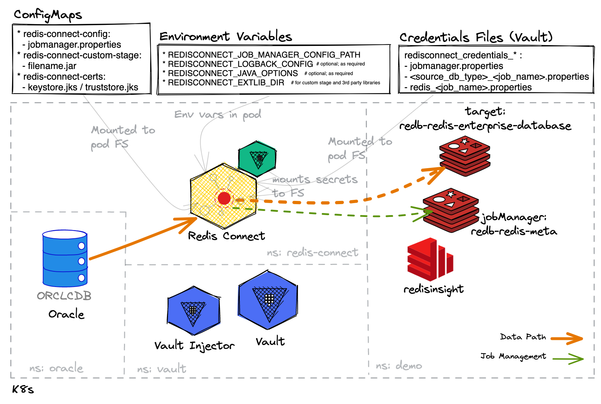

# Redis Connect Samples with Hashicorp Vault

## Notes
1. The injected credentials file must be named as follows: `redisconnect_credentials_jobmanager.properties` and `redisconnect_credentials_[redis|postgresql]_<job_name>.properties`.

2. The following role (or similar) is required in Vault for Redis Connect to connect with the source database:
```
vault write database/roles/redis-connect \
    db_name=aws-postgres \
    creation_statements="CREATE ROLE \"{{name}}\" WITH REPLICATION LOGIN PASSWORD '{{password}}' VALID UNTIL '{{expiration}}'; \
         GRANT SELECT ON ALL TABLES IN SCHEMA public TO \"{{name}}\"; \
         ALTER USER \"{{name}}\" WITH SUPERUSER;" \
    default_ttl="24h" \
    max_ttl="24h"
```

## Diagram


